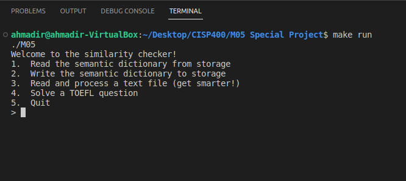

# Semantic Descriptor

## Overview

The Semantic Descriptor project, implemented in C++ with FLTK and Bash, introduces an intelligent language model designed to enhance its understanding by processing vast textual datasets. The goal is to develop a language model that discerns similarities among given words or phrases, making more informed decisions as it receives additional input. The algorithm intelligently trims common "stop words" to ensure accurate and focused descriptors. The graphical user interface (GUI) is built using FLTK graphics libraries on the Linux platform, providing users with an interactive experience.

## Features

- **Intelligent Learning:** The algorithm becomes smarter with more extensive input, analyzing massive novels to refine its language model.

- **Stop Word Filtering:** Common words that might dilute the significance of unique terms are identified and filtered out for improved accuracy.

- **Graphical User Interface (GUI):** The FLTK library is utilized to create an intuitive GUI, allowing users to input words or phrases and receive similarity assessments.

## How to Use

1. **Compile the Code:**
   - Compile the program using the provided source files: [list of source files].

2. **Run the Executable:**
   - Execute the compiled program to launch the Semantic Descriptor GUI.

3. **Input Words or Phrases:**
   - Use the GUI to input words or phrases for similarity analysis.

4. **Receive Results:**
   - The algorithm provides success or failure messages based on the performed operations.

